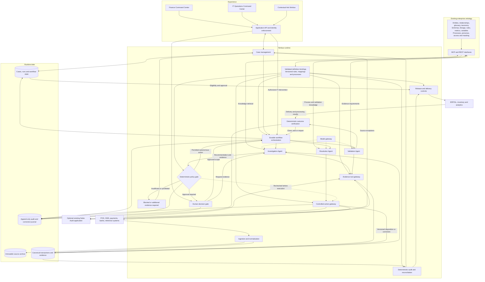
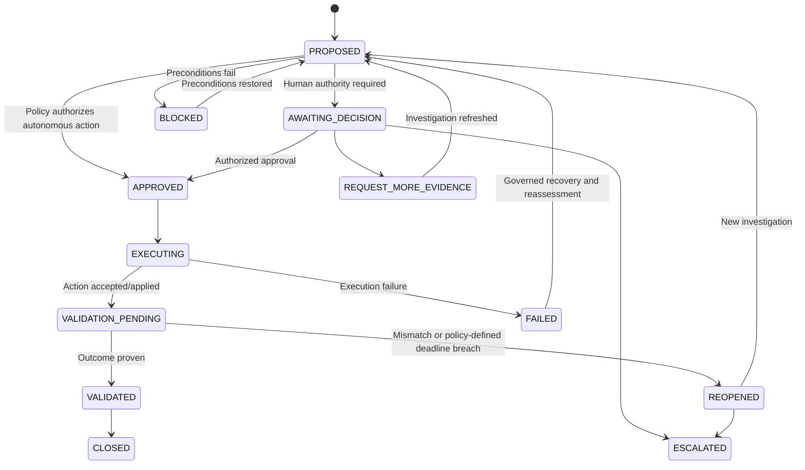

# Nimbus Sales Audit — Solution Design

**Product:** Nimbus Zero Touch Sales Audit
**Positioning:** Agentic Financial Exception Management for Retail Commerce
**Document date:** October 5, 2026
**Status:** Proposed logical solution design; technology and interface contracts subject to implementation validation
**Design principle:** Agents do the work. Humans manage by exception.

## 1. Purpose and executive summary

Nimbus provides continuous sales audit and financial exception management across retail sales channels, payments, refunds, settlements, and downstream financial systems. It combines a deterministic audit core, agents that investigate and coordinate work, durable resolution workflows, and the retailer’s existing enterprise ontology.

The core lifecycle is:

**Case → Evidence → Diagnosis → Policy → Decision → Action → Validation**

Nimbus collects facts, establishes why an exception exists, recommends a resolution, enforces authority, executes permitted actions, and verifies the outcome. Its Finance and IT workspaces present different views of the same cases, evidence, runs, and history.

The existing ontology remains the authoritative source for business meaning, rules, glossary, error mappings and lineage definitions, schemas, processes, metrics, semantic variables, personas, and governance. Nimbus accesses it through MCP and REST. No duplicate enterprise knowledge platform is proposed.

Financial arithmetic, reconciliation, permissions, policy decisions, and success checks are deterministic. Agents support investigation, evidence acquisition, planning, and explanation; model confidence alone cannot authorize an action.

This design covers the target product and a narrower synthetic-data demonstration. Illustrative amounts, thresholds, telemetry, counts, and timings in the demo are not production policy recommendations.

## 2. Scope and deployment boundary

### 2.1 Supported deployment modes

| Mode                                  | Nimbus responsibility                                                                                                                                  | Existing-system responsibility                                                                                              |
| ------------------------------------- | ------------------------------------------------------------------------------------------------------------------------------------------------------ | --------------------------------------------------------------------------------------------------------------------------- |
| Standalone sales audit                | Ingestion, transaction validation, totals, reconciliation, exception detection, case resolution, release eligibility, export orchestration, validation | POS/OMS originate business activity; processors execute payments; banks record cash movements; ERP owns accounting postings |
| Coexistence with an audit application | Consume source exceptions, collect cross-system evidence, investigate, enforce decision authority, orchestrate supported actions, validate results     | Existing audit application retains explicitly assigned audit rules, corrections, and/or exports                             |

The supplied demo specification emphasizes the operating-layer deployment. The target architecture also supports a standalone audit core. Deployment configuration must select which capabilities are enabled.

A rule/action/export ownership matrix is mandatory during onboarding. Nimbus and an existing application must never independently correct or export the same transaction. An integration adapter does not imply that every source system supports every proposed operation.

### 2.2 In scope

- Sales, returns, discounts, taxes, tenders, voids, and cancellations.
- Completeness, balancing, transaction audit, and selected financial reconciliations.
- Source-generated and Nimbus-generated exceptions.
- Evidence-driven investigation and governed resolution.
- Finance decisions and IT recovery interventions.
- Post-action validation, reopening, and escalation.
- Traceability from source record to downstream result.
- Ontology-driven definitions through MCP and REST.

### 2.3 Initial exclusions

- Replacement of payment processing, banking, POS, OMS, or ERP functions.
- Unrestricted agent SQL writes or arbitrary financial posting.
- Autonomous material financial corrections in the initial release.
- Production authentication and real bank/ERP integration in the synthetic demo.
- Exhaustive administration, mobile applications, model training, or many independently deployed agents before the flagship workflows work.

## 3. Outcomes and design principles

1. Reduce manual investigation while preserving financial correctness.
2. Make autonomous resolution conditional on sufficient evidence and delegated authority.
3. Show consequences before a decision and actual progress afterward.
4. Distinguish exception amount, estimated loss exposure, close impact, and pending validation.
5. Preserve original data and record corrections through versions or adjustment events.
6. Make missing evidence explicit; do not equate unavailable data with a financial mismatch.
7. Use shared identifiers and event history across Finance and IT.
8. Apply exact decimal arithmetic, explicit currencies, approved rounding, and effective-dated definitions.
9. Process routine transactions deterministically; invoke agents where investigation adds value.
10. Separate suggested causes from supported findings and approved knowledge from experimental patterns.

## 4. Logical architecture

Solid arrows indicate principal data or control interactions; dotted arrows indicate supporting services or enforcement dependencies. The diagram is logical: boxes do not mandate separate microservices.

### 4.1 Component responsibilities

| Component             | Responsibility                                                                                                                 |
| --------------------- | ------------------------------------------------------------------------------------------------------------------------------ |
| Ingestion             | Accept files/events/API payloads; archive originals; validate contracts; establish identity and normalize records              |
| Audit core            | Completeness, rules, totals, balancing, and deterministic exception detection                                                  |
| Reconciliation        | Match financial activity using identifiers and approved matching logic, including timing windows and one-to-many relationships |
| Case management       | Group related exceptions; maintain exposure, evidence status, close impact, ownership, and recommendations                     |
| Workflow orchestrator | Persist steps, approvals, timers, retries, dependencies, recovery, and terminal outcomes                                       |
| Agents                | Investigate, propose permitted steps, gather evidence, and coordinate validation                                               |
| Policy engine         | Enforce evidence sufficiency, authority, thresholds, period restrictions, automation mode, and current record conditions       |
| Tool gateways         | Restrict evidence retrieval and writes; enforce data access, idempotency, preconditions, and execution receipts                |
| Release engine        | Evaluate destination-specific eligibility, produce versioned outputs, and verify delivery                                      |
| Runtime stores        | Preserve actual records, cases, evidence snapshots, decisions, and execution history                                           |

### 4.2 How the architecture works end to end

Nimbus operates as a continuous, event-driven audit loop. Source arrivals, audit findings, human decisions, connector results, and validation deadlines advance durable workflows. The orchestrator owns execution state; agents are invoked for bounded investigation or coordination tasks and do not have to remain running while waiting for a file or settlement cycle.

#### Step 1 — Load the applicable business knowledge

Nimbus retrieves published ontology definitions through MCP or REST. These include source mappings, canonical entities, audit rules, evidence requirements, semantic variables, resolution processes, control policies, and metric definitions. The binding layer validates their applicability and connects them to tested queries, rule implementations, tools, and workflow templates.

For each store, legal entity, channel, and business date, Nimbus resolves the appropriate versions and contextual values such as cutoff time, tolerance, and approval threshold. Deterministic services use approved executable bindings; agents retrieve relevant explanations and relationships as needed. The ontology does not need to be queried for every transaction when an authorized versioned cache is available.

#### Step 2 — Receive TLogs and supporting source data

The primary sales feed can be TLog files containing sales, returns, discounts, taxes, and tenders. APIs or events are alternative ingestion paths. Control totals, manifests, and completion markers establish whether the expected delivery is complete. Payment, settlement, bank, and reference feeds arrive through their own connectors and schedules.

Direct access to store POS terminals is not required. A sufficiently complete TLog and supporting controls can supply the initial audit dataset. Optional read-only access to a centralized POS journal or transaction repository supports investigations that require original-source confirmation or recovery of records missing from a TLog.

Every received payload is archived with its source identity, receipt time, and checksum. Nimbus distinguishes a repeated delivery from a separate business transaction before normalization.

#### Step 3 — Normalize records and establish lineage

The ingestion service uses approved mappings to convert source records into the canonical transaction model. It preserves source IDs, parent relationships, currencies, signs, timestamps, business dates, mapping versions, and references to the original payload.

Malformed or unmappable records are quarantined with reasons. Accepted records are stored in the canonical transaction/evidence store. Source control records remain distinguishable from totals calculated by Nimbus so completeness checks compare independently supplied evidence.

#### Step 4 — Run deterministic audit and reconciliation

The audit engine checks completeness, references, transaction relationships, totals, and balancing rules. The reconciliation engine compares appropriate sales, payment, refund, settlement, and bank activity using approved identifiers, matching logic, and time windows.

Routine records that pass the required controls proceed toward destination-specific release eligibility without an agent investigation. Failed controls create exceptions. An optional existing Sales Audit application can also supply exceptions directly, subject to the agreed ownership matrix.

#### Step 5 — Create a case and start investigation

Case management attaches the canonical exception type, affected records, amount, estimated exposure, close impact, detection-rule version, and known evidence. Related exceptions may be grouped into a case or linked to a common incident while retaining their individual identities.

The workflow orchestrator starts or resumes an investigation. The Investigation Agent uses the ontology to identify required evidence, possible causes, relevant system relationships, and approved investigation procedures. A possible cause is a hypothesis until supported by actual evidence.

#### Step 6 — Acquire evidence through controlled tools

The agent first checks evidence already held by Nimbus. If that evidence is sufficiently fresh and authoritative, no live external query is necessary. Missing, stale, or conflicting evidence triggers a bounded request through the read-only evidence gateway.

For example, the gateway can retrieve an original POS journal entry, payment refund confirmation, settlement batch, or accounting-period status. It handles source credentials, access restrictions, approved queries, masking, and provenance. Retrieved facts are persisted as evidence snapshots linked to the case and source records.

A TLog cannot provide a transaction absent from that file. If a source lookup or replacement feed is unavailable, the case records the evidence gap and remains pending or is routed for review. The agent must not infer that a payment occurred or invent a missing transaction.

#### Step 7 — Produce a diagnosis, recommendation, and proposed workflow

Using the collected facts and ontology knowledge, the agent produces structured findings, remaining uncertainty, a recommended disposition, and the permitted sequence of next steps. The proposal identifies financial-write scope, expected effects, evidence references, control gates, and validation obligations.

The proposed workflow describes both success and failure paths before execution. Plans may be conditional when information is missing, but a conditional plan is not executable authorization. Arithmetic and reconciliation results are supplied by deterministic services rather than calculated by the model.

#### Step 8 — Evaluate deterministic controls and request authority

The policy engine checks required evidence, proposed action class, actor authority, thresholds, aggregate exposure, accounting-period restrictions, automation mode, and current record versions. It returns a recorded outcome: permit autonomous execution, require human approval, request additional evidence, or block.

Where Finance approval is required, the Command Center shows the situation, evidence, recommendation, policy result, exact authorization scope, subsequent workflow, and validation criteria. An approval references the reviewed recommendation and evidence snapshot. Additional-evidence requests return the case to investigation; material new facts require reassessment.

IT can intervene in operational recovery within its role. Retrying a connector or changing an operational mode cannot satisfy a Finance approval requirement.

#### Step 9 — Execute the approved resolution

The durable orchestrator dispatches the authorized workflow. The Resolution Agent can coordinate permitted steps, but every mutation passes through the controlled action gateway. The gateway rechecks authorization and preconditions, applies idempotency controls, and records execution receipts and correlation IDs.

An action may apply a disposition entirely within Nimbus, recover a source file, request supported reprocessing, or produce an explicitly permitted correction. Not every resolution requires an external write. A timing disposition, for example, classifies a difference and schedules monitoring without posting a financial adjustment.

Original records remain preserved. Changed transaction versions are re-audited. If an external request times out after submission, Nimbus checks the resulting status before retrying to avoid duplicate actions. Technical failures remain visible and follow the defined recovery or escalation path.

#### Step 10 — Validate the actual outcome

Execution completion creates or advances a validation obligation. The Validation Agent gathers fresh evidence at the appropriate time; deterministic verification checks whether the promised result occurred.

A verified outcome moves the case through Validated to Closed. An established mismatch or policy-defined deadline breach can reopen or escalate it. If a connector is unavailable, Nimbus distinguishes missing evidence from a failed financial outcome. The orchestrator persists the waiting state and resumes on an evidence arrival or timer.

Approval and a successful tool response are not substitutes for this validation step.

#### Step 11 — Release eligible data and verify delivery

The release service evaluates each downstream destination using audit results, active controls, approvals, and the case's close-eligibility state. It creates versioned exports with duplicate protection and tracks acceptance and processing results from ERP/GL, inventory, or analytics systems.

Release does not always wait for every settlement case to close. A policy-approved timing disposition may allow today's eligible sales export while a next-cycle settlement obligation remains open. Conversely, a duplicate affecting GL must remain subject to the relevant export control until safe handling is established.

Downstream acknowledgments and processing failures feed back into validation and case workflows. Corrections to already-posted data follow the approved adjustment process.

#### Step 12 — Update both personas and preserve the audit record

Case transitions, evidence updates, decisions, retries, and validation results update the shared operational state. Finance sees financial priorities and decision consequences; IT sees connector health, affected runs, recovery state, and links to the same cases.

KPIs are calculated using ontology metric definitions and current runtime records. The audit journal links source evidence, ontology versions, findings, policy results, human decisions, action attempts, and outcomes. Ask Nimbus explains that same role-filtered state and cannot bypass the decision or execution controls.

### 4.3 Worked example: approval followed by settlement validation

For the illustrative $550 case, assume a signed reconciliation bridge has first established a genuine timing difference; the unresolved source-amount semantics noted in Section 12.1 must be settled before building the fixture.

| Stage           | Component interaction                                           | Result                                                                    |
| --------------- | --------------------------------------------------------------- | ------------------------------------------------------------------------- |
| Detect          | Source feeds → normalization → reconciliation engine          | A $550 variance produces a case                                           |
| Understand      | Investigation Agent → ontology via MCP/REST                    | Retrieves timing-difference evidence requirements and process             |
| Establish facts | Evidence store / read-only tools → Investigation Agent         | Obtains the applicable refund, payment, bank, and accounting evidence     |
| Recommend       | Investigation Agent → policy engine                            | Proposes a timing disposition with no financial write                     |
| Authorize       | Policy engine → Finance                                        | Illustrative ST-004 requires approval above $250                          |
| Execute         | Finance decision → workflow → controlled action gateway       | Applies the disposition and records the decision/evidence package         |
| Wait            | Workflow → validation obligation                               | Case remains Executed — Validation Pending                               |
| Verify          | Next-cycle evidence → Validation Agent → deterministic checks | Confirms the expected movement, waits for evidence, or identifies failure |
| Finish          | Verification → workflow → shared case/history                 | Closes on verified success or reopens/escalates under policy              |

If the settlement connector degrades during validation, IT sees the impacted evidence request and recovery attempts linked to this case. Recovery resumes the validation obligation; it does not change the original Finance authority or fabricate an outcome.

### 4.4 What each architectural layer contributes

- **Source systems and feeds:** supply facts about business activity and processing results.
- **Existing ontology:** defines meaning, evidence requirements, rules, relationships, processes, and authority.
- **Agents:** investigate evidence, formulate recommendations, and coordinate permitted work.
- **Deterministic services:** calculate, reconcile, enforce controls, and verify outcomes.
- **Durable workflows:** make progress recoverable across delays, approvals, retries, and failures.
- **Runtime stores and audit journal:** retain actual state, evidence, decisions, and execution lineage.
- **Command Centers:** let Finance and IT supervise the same operation through their respective responsibilities.

## 5. Ontology: role, ownership, and integration

### 5.1 Reuse of existing ontology modules

| Existing module           | Sales audit use                                                                                            |
| ------------------------- | ---------------------------------------------------------------------------------------------------------- |
| Metadata / Schema Builder | Physical tables, columns, APIs, files, identifiers, verified joins, grain, and source mappings             |
| Entities                  | Sale, tender, refund, settlement, exception, case, evidence, recommendation, decision, and workflow        |
| Logical Relationships     | Sale-to-payment, return-to-original-sale, settlement-to-deposit, error-to-impact, and process dependencies |
| Taxonomies & Hierarchies  | Canonical exception families; source-code mappings; channel, tender, and organizational hierarchies        |
| Business Glossary         | Agreed meaning of variance, financial exposure, settlement, close readiness, and zero touch                |
| Business Rules Catalog    | Audit rules, evidence requirements, approval thresholds, permitted actions, and outcome checks             |
| Metrics Catalog           | Versioned formulas and populations for operational and financial KPIs                                      |
| Semantic Variables        | Contextual cutoffs, tolerances, business dates, currencies, thresholds, and deadlines                      |
| Business Processes        | Investigation procedures, remediation workflows, alternate paths, validation, and escalation               |
| Personas                  | Responsibilities and decision ownership for Finance and IT                                                 |
| Access & Governance       | Knowledge and data access, approval authority, publication lifecycle, and permitted automation             |
| PII & Masking Policies    | Field restrictions and masking before evidence reaches agents, users, or logs                              |

### 5.2 Definition versus occurrence

The ontology defines how a duplicate exception is classified, what evidence it requires, how it may be resolved, and what proves success. Nimbus records the actual source records, rule evaluations, findings, decisions, action attempts, and results for a particular case.

Runtime instances may be stored in the ontology platform's graph if it supports that workload. Logical separation is still required between published definitions, case facts, hypotheses, and unapproved proposals. The design does not require a second graph database.

### 5.3 MCP and REST

Both interfaces should expose consistent ontology identifiers, versions, provenance, and permission-filtered content.

- **MCP:** convenient for agent discovery and contextual retrieval of relevant definitions and relationships.
- **REST:** convenient for structured retrieval by audit, policy, workflow, and application services.
- Either interface may serve either consumer where appropriate; protocol choice does not alter authority.
- Operational evidence and action tools can also use MCP or REST but have separate permissions and contracts.

An ontology lookup describing a table or action does not grant access to that table or permission to perform the action.

### 5.4 Runtime bindings

Before activation, bind each published definition to a tested executable expression, query template, tool contract, or workflow template. Descriptive prose remains explanatory until it has a validated implementation.

A binding includes:

- Definition identifier, version, status, and effective period.
- Tenant, legal entity, channel, source version, and other applicability constraints.
- Typed inputs, units, currencies, null handling, and outputs.
- Resolved semantic variables and authoritative sources.
- Executable expression or implementation reference.
- Evidence requirements, access constraints, and permitted action class.
- Test cases, owner, approval record, and deployment version.

Published changes follow **Draft → Reviewed → Tested → Published → Retired**. Agents may propose changes but cannot publish production policy changes independently.

An in-flight workflow records its definition versions. Execution also checks current authorization and emergency prohibitions; a pinned historical version cannot bypass a newly revoked permission. Material changes to evidence or policy may require a refreshed recommendation and approval.

### 5.5 Availability and caching

Use approved, versioned definition caches with explicit freshness and invalidation rules. When ontology access is unavailable, permitted processing may continue against an authorized cached version. Actions whose authority cannot be established are held. Record the version actually used; do not silently substitute a different rule.

### 5.6 Error lineage model

| Lineage   | Required trace                                                                           |
| --------- | ---------------------------------------------------------------------------------------- |
| Data      | Original record → transformation/mapping version → normalized record                   |
| Detection | Inputs → audit or source rule → generated exception                                    |
| Diagnosis | Evidence references → supported findings; unresolved hypotheses remain labeled          |
| Decision  | Recommendation → policy evaluation → delegated or human authority                      |
| Execution | Workflow → tool call → connector attempt → acknowledgment                             |
| Outcome   | Validation obligation → retrieved evidence → deterministic result → final disposition |

This is explainable provenance, not hidden chain-of-thought.

## 6. Functional capabilities

### 6.1 Ingestion and normalization

Support API, event, and file ingestion according to source capability. Retain original payloads before transformation. Assign source record identity separately from delivery identity so retries do not create duplicate business transactions.

Validate schema, required identifiers, decimals, currency, timestamps, and transaction relationships. Quarantine malformed records with actionable reasons. Record source-to-canonical transformation versions and support governed replay.

### 6.2 Completeness and store-day management

Use independent control totals, sequence information, manifests, and end-of-day markers to determine completeness. Define expected source coverage by store/channel/business date. Sequence gaps are indicators requiring source-specific interpretation, not automatic proof of lost sales.

Manage late arrivals, dependencies, and cutoff schedules. Recompute affected results when new evidence arrives; invalidate stale recommendations when their assumptions change.

### 6.3 Audit, totals, and reconciliation

Calculate exact-decimal totals and evaluate versioned rules. Reconcile across transactions, declared totals, payments, refunds, processor settlements, and bank records. Support one-to-many, many-to-one, and partial matches with documented tolerances and ambiguity handling.

Keep event time, business date, processing time, settlement date, and accounting date distinct. Do not add different currencies without an explicit conversion basis. Prevent double-counting by respecting source grain and join cardinality.

### 6.4 Case creation and investigation

Create cases from source errors or Nimbus controls. Group related exceptions by an established relationship or shared suspected incident while preserving each underlying exception and its amount. Avoid hiding unresolved items through grouping.

Investigation assembles required evidence, evaluates candidate causes, checks contradictions, and produces a structured recommendation. Unsupported findings and missing evidence remain explicit. Evidence completeness is calculated from applicable requirements, not assigned by the model.

### 6.5 Resolution and validation

Apply dispositions, request recovery, or execute other approved procedures through bounded tools. Record preconditions and expected postconditions. Validation obtains fresh outcome evidence and uses deterministic checks.

A successful API response proves acceptance of a request only to the extent defined by the contract; it does not automatically prove financial completion. Track asynchronous results and downstream acknowledgments.

### 6.6 Release and downstream delivery

Evaluate eligibility separately for each destination. Track transaction versions, export identity, acceptance, rejection, and downstream processing. Prevent duplicate exports and support approved correction or adjustment flows after posting.

### 6.7 Ask Nimbus

Answer questions using current case state, ontology definitions, and evidence accessible to the user. Cite relevant case/evidence references and policy versions. Proposed actions are presented through normal decision controls; chat cannot bypass authorization or invent completed work.

## 7. Agent and deterministic-service design

| Role                  | Inputs                                                               | Outputs                                                                   | Boundary                                       |
| --------------------- | -------------------------------------------------------------------- | ------------------------------------------------------------------------- | ---------------------------------------------- |
| Investigation Agent   | Case, ontology definitions, evidence tools, prior supported findings | Evidence-backed diagnosis, missing-evidence requests, resolution proposal | Cannot declare authority or fabricate facts    |
| Resolution Agent      | Approved recommendation, process definition, execution state         | Permitted next-step requests, execution coordination                      | No unrestricted SQL or connector credentials   |
| Validation Agent      | Validation obligation, deadline, expected observations               | Evidence collection and verification requests                             | Deterministic checks establish success/failure |
| Reconciliation engine | Canonical financial records and matching definitions                 | Matches, variances, ambiguity, lineage                                    | No LLM arithmetic                              |
| Policy engine         | Proposed action, actor, evidence, scope, active rules                | Permit, require approval, request evidence, or block                      | Enforced outside model reasoning               |
| Workflow engine       | Events, decisions, timers, action results                            | Persistent state transitions                                              | Owns retries and recovery                      |

A model gateway provides approved model routing, structured output validation, timeouts, token/cost budgets, and evaluation telemetry. Source records and retrieved documents are untrusted data; instructions embedded in them cannot grant permissions or alter system controls.

## 8. Workflow and state model

### 8.1 Main lifecycle

Autonomous approval is a recorded policy decision, not an implied human signature. Operational failures and financial validation failures remain distinct. Missing evidence is normally pending until a policy-defined deadline requires escalation.

### 8.2 Separate dimensions

| Dimension             | Example values                                                                     |
| --------------------- | ---------------------------------------------------------------------------------- |
| Case lifecycle        | Open, under investigation, awaiting decision, validation pending, closed, reopened |
| Workflow execution    | Ready, running, waiting, paused, failed, completed                                 |
| Evidence              | Complete, incomplete, stale, conflicting                                           |
| Close eligibility     | Eligible, blocked, conditionally eligible                                          |
| Settlement obligation | Not due, pending, matched, overdue, mismatched                                     |
| Destination delivery  | Not eligible, ready, sent, accepted, rejected, verified                            |

### 8.3 Resolution workflow object

Every workflow records trigger, template/version, steps, responsible actor, control gates, current state, next action, alternate path, validation obligations, deadlines, and final outcome. Finance sees consequences before approval; IT sees recovery and escalation paths before intervention.

### 8.4 Execution reliability

Use idempotency keys for actions, optimistic version checks or equivalent concurrency controls, transactional event publication, and bounded retries. After uncertain outcomes, query status before retrying. Do not claim distributed exactly-once execution without source support; use duplicate protection and reconciliation.

Approval is tied to a specific recommendation, evidence snapshot, scope, and policy result. Changed material inputs invalidate or suspend the approval according to policy. Already-posted financial changes use approved compensating adjustments rather than silent history edits.

## 9. Personas and user experience

### 9.1 Shared shell

Persistent dark navy Nimbus rail, persona selector, warm neutral workspace, compact KPIs, decision rows, inline detail, right-side signals, and contextual Ask Nimbus. Avoid separate routine pages for exceptions, investigations, and approvals.

Every expanded item answers: situation, significance, evidence, assessment, deterministic controls, required decision, subsequent workflow, and validation.

### 9.2 Finance

Navigation: Command Center, History, and optional Analytics. Group work into Ready for Decision, Needs Review, and collapsed Agent Handled. Show exception amount and financial exposure separately.

Controls include Approve Recommendation, Request More Evidence, and Escalate. Authorized alternative dispositions require a selected alternative and reason; preserve original recommendation and decision provenance.

### 9.3 IT

Navigation: Command Center, Runs & Queues, Integrations, Controls, and Audit. Group work into Needs Intervention, Self-Recovering, and Resolved. Show affected evidence requests, runs, cases, exposure scope, and close obligations without overstating financial impact.

Interventions include Retry Now, Pause Connector, and Open Run Trace. Mode changes require confirmation, reason, actor, timestamp, and audit event. Define mode behavior explicitly:

- Governed Automation: approved classes may execute autonomously.
- Recommendation Only: investigation proceeds; autonomous operational/financial resolution writes are withheld.
- Investigation Only: collect and analyze evidence; no resolution execution.
- Pause Automation: stop scheduling new autonomous work; reconcile in-flight action status safely before further execution.

Connector retry permissions remain distinct from Finance authorization. Emergency stop scope and treatment of in-flight actions must be configured and tested.

## 10. Integrations and required data

### 10.1 Business sources

| Integration                        | Required data                                                                                     | Purpose                                    |
| ---------------------------------- | ------------------------------------------------------------------------------------------------- | ------------------------------------------ |
| POS / sales channels               | Headers, lines, quantities, prices, taxes, discounts, tenders, voids, returns, source IDs         | Transaction audit and balancing            |
| POS control feeds                  | Registers/sessions, sequence information, manifests, declared totals, completion markers          | Independent completeness checks            |
| E-commerce / OMS                   | Orders, fulfillment, cancellation, payment/return links and timestamps                            | Omnichannel event interpretation           |
| Returns/refund systems             | Original sale, returned lines, amount, method, status, timestamps, refund reference               | Refund evidence and mismatch investigation |
| Payment processor                  | Authorizations, captures, reversals, voids, refunds, statuses, merchant and payment references    | Independent payment confirmation           |
| Processor settlement               | Batch/detail records, gross/net components, fees, refunds, chargebacks, adjustments, dates        | Settlement reconciliation                  |
| Bank feeds                         | Deposits/withdrawals, currency, posting/value dates, bank and processor references                | Confirm cash movements                     |
| Cash management                    | Till counts, paid-in/out, safe drops, deposit bags, confirmations                                 | Cash balancing and deposits                |
| Gift-card platform                 | Issue, redeem, reload, reverse, balance movements, references                                     | Stored-value reconciliation where in scope |
| Reference systems                  | Products, promotions, prices, stores, legal entities, tenders, currencies, calendars              | Effective-dated validation context         |
| ERP/GL                             | Period status, mappings, posting references, acknowledgments, rejections, relevant posted amounts | Posting evidence and downstream validation |
| Inventory/analytics destinations   | Accepted/rejected version, processing status, destination reference                               | Delivery verification                      |
| Existing audit/reconciliation tool | Errors, transactions, totals, match results, rule versions, store-day/export status               | Coexistence and source-generated cases     |

### 10.2 Shared record contract

As applicable, capture:

- Tenant and legal entity; store, channel, register/session, merchant account.
- Source system and version; source record ID and delivery ID.
- Transaction/order/payment/refund/settlement identifiers and parent references.
- Record type, status, currency, signed amount, amount component, quantity, and unit.
- Event timestamp with timezone, business date, processing time, settlement/value date, and accounting date.
- Source revision, schema version, mapping version, checksum, and retrieval/receipt timestamp.
- Data classification, access scope, and provenance.

Never assume a transaction ID is globally unique. Use source-qualified identity and documented matching rules. Preserve both native identifiers and canonical identifiers.

### 10.3 Operational integrations

Collect connector health, latency, timeout/error codes, authentication status, file arrivals, queue state, processing checkpoints, rate limits, retry counts, and correlation IDs. Link each evidence request and action attempt to its case and workflow.

Supported recovery actions may include retrieve file, replay verified source record, reprocess rejected record, query action status, or pause/resume a connector. Validate capabilities for each source; do not infer mutation support from read access.

### 10.4 Integration contract requirements

For each connector specify owner, authority, direction, cadence, expected delay, authentication, schema version, pagination, rate limits, timeout, retry policy, idempotency behavior, control totals, completion indicators, and failure recovery.

Full card numbers and security codes are not required. Use permitted tokens/masked identifiers. An unavailable integration limits the corresponding automation; it must not be replaced with invented evidence.

### 10.5 First production integration scope

One POS and control feed, one processor, one bank feed, the existing ontology, required reference data, and one downstream destination. Expand channels and financial scenarios after end-to-end correctness is demonstrated.

## 11. Logical data model

| Object               | Important attributes and relationships                                                                |
| -------------------- | ----------------------------------------------------------------------------------------------------- |
| SourceRecord         | Source identity, payload reference, checksum, event/receipt times, source version                     |
| CanonicalTransaction | Source links, business identity, lines/tenders, amounts, dates, canonical version                     |
| ReconciliationMatch  | Member records, match method/version, signed components, currency, residual, ambiguity                |
| Exception            | Detection origin, canonical type, source code, rule version, affected records, exception amount       |
| Case                 | Related exceptions, lifecycle, exposure estimate/basis, close impact, ownership, incident links       |
| EvidenceSnapshot     | Required evidence type, record references, event/retrieval times, status, freshness, contradictions   |
| Finding              | Supported conclusion or hypothesis, evidence references, confidence category and rationale            |
| Recommendation       | Disposition, action class, evidence version, expected impact, workflow template                       |
| PolicyEvaluation     | Inputs, rule versions, resolved variables, result, reason codes                                       |
| HumanDecision        | Actor, role, scope, recommendation version, choice, override reason, timestamp                        |
| Workflow / Step      | Definition/version, state, actor, dependencies, gates, timers, next action                            |
| ActionAttempt        | Tool/version, parameters reference, idempotency key, correlation ID, response, uncertain outcome flag |
| ValidationObligation | Expected observation, due window, evidence requirement, verification rule, status/result              |
| ExportRecord         | Destination, transaction version, export identity, acknowledgment and processing status               |
| AuditEvent           | Event identity/time, actor, object references, causation/correlation IDs, before/after references     |
| ConnectorIncident    | Technical evidence, affected requests/runs/cases, recovery attempts, status                           |

An exception's nominal amount is not automatically its financial exposure. Exposure needs a defined basis and must avoid duplicate counting across related exceptions. The same applies when aggregating incident impact.

## 12. Flagship scenarios and demo design

### 12.1 Settlement timing difference — ZA-20261006-0147

Illustrative exception amount $550; estimated exposure $0; policy ST-004; autonomous disposition threshold $250; action class Disposition Only. Complete evidence and a supported timing explanation lead to Finance Approval Required.

Before approval show: lock decision/evidence → apply timing disposition → schedule next-cycle validation → reconcile expected movement → close or reopen. No financial journal or posting is authorized.

After approval: **Executed — Validation Pending**. Success requires matching evidence within the approved reconciliation window. An established mismatch or deadline breach reopens/escalates. Connector unavailability is represented separately as evidence unavailable.

The supplied sales/payment/bank figures are $148,725.40 / $148,175.40 / $148,175.40. The original narrative attributes the $550 variance to a refund after cutoff. Before implementation, define whether each total is gross or net and which cutoff it covers: those figures alone do not prove the refund explanation. Use a signed reconciliation bridge validated against the synthetic records; do not encode an unsupported explanation.

Approval may remove a current close blocker while validation remains pending only if policy explicitly permits it.

### 12.2 Duplicate sales transaction

Source code DUP_TRAN maps to DUPLICATE_SALES_TRANSACTION. Example transaction 84291753, amount $186.42, potential GL export impact. Evidence demonstrates two audit records but one authoritative sale, one payment capture, and one relevant settlement.

Workflow: Confirm Duplicate → Apply Governed Disposition → Protect Legitimate Transaction → Validate Totals → Validate Downstream Processing → Close. Choose the allowed disposition through policy; do not delete original evidence.

### 12.3 Zero-touch card tender over/short

Illustrative variance $3.42, tolerance $5.00, required evidence complete, no identified policy/fraud indicator, period open. The approved policy must specify the actual disposition and any write it permits; being under tolerance alone is insufficient.

Retrospective: Detected → Investigated → Policy Passed → Disposition Applied → Validated → Closed. Human involvement None. Approximate eight-minute effort avoidance is a labeled configured baseline, not measured savings.

### 12.4 Return missing tender

Source context RETURN_TENDER_REQ; amount $94.22; payment refund confirmation missing. Evidence completeness 60% is a demo value that must correspond to defined requirements. Confidence Low; Human Review Required. Nimbus refuses execution and offers Request Evidence, Route to Analyst, or Escalate. It must never synthesize a refund confirmation.

### 12.5 Invalid promotion/discount

Retrieve sale-line detail and the effective promotion definition, eligibility, validity window, and mapping history. Distinguish expired/ineligible promotion from delayed reference data or transformation error. Recover/reprocess only when authoritative evidence supports it; proposed monetary corrections require applicable authority.

### 12.6 Missing transaction sequence

Compare source-specific sequence expectations, manifests, receipt logs, and source archive. Retrieve and replay a proven missing source record through normal ingestion. Verify uniqueness, completeness, totals, and downstream delivery. Never manufacture a missing sale from a sequence gap.

### 12.7 Store day not ready to load

Identify missing prerequisites such as expected file, reference refresh, completion marker, or ordered job. Wait or invoke approved recovery; load only after deterministic prerequisites pass. Preserve dependency evidence and deadline/escalation status.

### 12.8 Settlement connector degradation

Illustrative telemetry: normal 410ms, current 4.8s, 504 timeout, authentication healthy, seven evidence requests delayed, three investigations waiting, $1,190 related exception value, zero financial actions affected.

Recovery: Retry Connector → Resume Runs → Validate Evidence → Clear Alert. Exhaustion: Open Circuit → Protect Affected Work → Recommendation-Only Behavior for the affected scope → Escalate.

Define the example budget as **three total requests: initial request plus two retries**, with exponential backoff. A successful transport response must still pass evidence validation before clearing affected work.

Run RUN-20261006-114328 and correlation COR-8439201 can link to the Finance hero case. To preserve the hero's complete 9:14 AM evidence, the failing run must be explicitly a later refresh or validation retrieval, not the original mandatory evidence acquisition. Demo timestamps must reflect that relationship.

### 12.9 Dataset consistency

Use 128 synthetic exceptions: 75 Transaction Audit, 35 Financial Reconciliation, 18 Operational/Data. One valid initial partition is 74 closed without analyst touch + 31 investigation-complete + 23 other open/in-progress = 128. The 18 human decisions are a subset of the 31, not an additional bucket. Assign explicit states to the remaining 13 investigation-complete cases.

Business date October 6, 2026 is an intentional simulated date. Readiness 91%, $2,460 exposure, $18,740 exception value, and 22.6 hours avoided must either be derived from the fixture or labeled illustrative fixed values. Subsequent actions must update dependent operational counts consistently.

Provide resettable, persistent demo state and explicit simulation outcomes. Both personas operate on one dataset. Simulation controls are clearly labeled and absent from production workflows.

## 13. Controls, security, and auditability

- Enforce tenant and legal-entity isolation throughout ontology retrieval, storage, tools, and UI.
- Apply least-privilege service identities; keep connector secrets outside model context.
- Separate knowledge access, evidence read access, action authority, and Finance approval.
- Enforce applicable segregation of duties; an IT mode change cannot waive Finance approval.
- Apply PII minimization and masking before prompt construction or logging.
- Preserve original records and tamper-evident/append-only audit events with controlled retention.
- Store policy versions, evidence snapshots, decisions, tool outcomes, and validation results.
- Recheck authority, record version, and critical preconditions immediately before writes.
- Enforce aggregate exposure limits as well as per-transaction limits.
- Treat untrusted source text as data and prevent it from selecting arbitrary tools or changing permissions.
- Record evidence, findings, conclusions, and actions rather than hidden chain-of-thought.
- Define revocation, emergency stop, retention, residency, and access-review requirements with the retailer before production.

## 14. Nonfunctional design and technology approach

Start with a modular backend and separately scalable ingestion, deterministic-processing, and agent workers. Service separation should follow actual workload and ownership needs.

| Capability                         | Proposed implementation category                                                |
| ---------------------------------- | ------------------------------------------------------------------------------- |
| Application and operational state  | Transactional relational database and typed application APIs                    |
| Raw payloads and evidence packages | Encrypted object storage with retention controls                                |
| Asynchronous processing            | Durable queues/events, transactional outbox, idempotent consumers               |
| Long-running processes             | Durable workflow runtime with timers and recovery                               |
| Audit calculations                 | Tested decimal-arithmetic services and versioned rule evaluation                |
| Ontology integration               | Existing MCP and REST interfaces plus validated binding/cache layer             |
| Agent execution                    | Tool-restricted runtime behind a model gateway                                  |
| Lineage traversal                  | Relational links initially or existing graph capability where justified         |
| Search                             | Structured filtering; semantic retrieval for explanatory documents where useful |
| Observability                      | Correlated metrics, logs, traces, workflow history, and model/tool evaluations  |

Set production SLOs after measuring daily and peak volume, event/file size, stores, currencies, evidence latency, and close deadlines. Define availability, latency, backlog recovery, RPO/RTO, retention, and cost budgets before production; no unvalidated throughput claims are made here.

Apply backpressure, per-source rate limits, queue isolation, bounded retries, and circuit breakers. Agent/model outages should not stop eligible deterministic audit processing. Cases requiring unavailable reasoning or evidence remain queued with clear state.

## 15. Testing and acceptance

### 15.1 Test layers

- Data contract tests for schemas, signs, decimals, dates, grain, and identifiers.
- Golden datasets for totals, refund handling, matching, and currency/rounding behavior.
- Ontology binding tests for applicability, versions, variable resolution, and executable consistency.
- Agent evaluations for grounded findings, tool selection, missing-evidence refusal, contradictions, and instruction injection.
- Workflow tests for approval scope, stale evidence, duplicate clicks, retries, unknown outcomes, and reopening.
- Connector tests for partial files, missing pages, late arrivals, throttling, timeouts, duplicate delivery, and recovery.
- Security tests for tenant isolation, roles, masking, and approval boundaries.
- End-to-end financial tests from source identity to verified downstream result.

### 15.2 Required acceptance outcomes

1. Finance can understand the case, evidence, controls, authorization, and next workflow without navigating multiple pages.
2. Approving the $550 disposition performs no financial posting and leaves validation pending.
3. Expected settlement evidence closes the case; an established failure reopens it; missing evidence remains distinguished.
4. IT sees recovery history, next attempt, affected cases, and escalation boundary in one workspace.
5. Connector recovery resumes affected work without duplicate actions or changed Finance authority.
6. The $3.42 case demonstrates a fully validated autonomous path.
7. Missing refund confirmation blocks automation for the $94.22 return.
8. Duplicate handling preserves the legitimate sale and validates downstream impact.
9. Every executed action is linked to permitted authority, evidence, and a validation result or outstanding obligation.
10. Finance and IT share consistent history and ontology versions.

## 16. Metrics

Metric definitions and populations live in the ontology Metrics Catalog. Runtime values include:

| Metric                           | Definition considerations                                                                                  |
| -------------------------------- | ---------------------------------------------------------------------------------------------------------- |
| Close readiness                  | Explicit eligible/expected population; display blockers separately                                         |
| Unresolved exposure              | Approved exposure basis, currency treatment, and deduplication across linked cases                         |
| Zero-touch completion            | Cases closed after validation without human intervention; also show eligible and total populations         |
| Investigation complete           | Cases with a current evidence-backed recommendation; distinguish awaiting decision from awaiting execution |
| Human decisions                  | Active decision requests, excluding awareness signals                                                      |
| Time to verified resolution      | Detection to validated completion, with waiting periods distinguishable                                    |
| Reopen/incorrect resolution rate | Include later validation failures and downstream corrections                                               |
| Research avoided                 | Configured baseline minus observed human effort where measurable; label illustrative estimates             |
| Run success                      | Defined terminal run population and treatment of retries/cancellations                                     |
| Unauthorized actions             | Attempted, blocked, and actually executed unauthorized actions reported separately                         |

Do not optimize closure count at the expense of unresolved financial obligations.

## 17. Delivery roadmap

| Stage                   | Deliverable                                                                           | Exit condition                                                          |
| ----------------------- | ------------------------------------------------------------------------------------- | ----------------------------------------------------------------------- |
| 1. Domain and contracts | Ownership matrix, ontology inventory, scenario definitions, source contracts          | Eight scenarios have consistent facts, evidence, controls, and outcomes |
| 2. Stateful demo        | Shared shell, Finance hero, workflow/validation, IT recovery, shared audit history    | Mandatory primary paths pass with coherent synthetic data               |
| 3. Audit foundation     | Real ingestion, completeness, totals, reconciliation, versioned ontology bindings     | Golden and failure datasets produce correct deterministic results       |
| 4. Shadow investigation | Agents investigate live cases without writes                                          | Groundedness, refusal, latency, and cost meet agreed gates              |
| 5. Bounded autonomy     | Selected recovery/disposition workflows and independent validation                    | Correct outcomes under retries, late evidence, and partial failure      |
| 6. Expansion            | Additional channels, exception types, integrations, and controlled correction classes | Evidence and measured correctness justify each increase in authority    |

Begin production with completeness recovery, reference-data recovery, duplicate investigation, and timing dispositions where evidence and source capabilities support safe execution. Financial correction scope expands only through explicit policy and validation design.

## 18. Decisions required before implementation

1. Select initial deployment mode and assign ownership of every audit rule, correction, and export.
2. Inspect the actual ontology MCP/REST contracts; confirm rule/process executability, versioning, permissions, and cache semantics.
3. Establish authoritative source fields, joins, currencies, signs, and cutoff definitions.
4. Correct the $550 signed reconciliation story and align Finance/IT evidence timestamps.
5. Define eligible close conditions while settlements remain pending.
6. Confirm connector mutation capabilities, idempotency, acknowledgment, and recovery contracts.
7. Approve the initial autonomous action classes and aggregate limits.
8. Define production scale, retention, access, availability, and recovery objectives.
9. Obtain the existing Nimbus demo and Chief Merchant visual reference for implementation fidelity.

These are implementation inputs rather than assumptions to conceal in mock data or prompts.

## 19. Design provenance and limitations

This document synthesizes the supplied Nimbus specification and the subsequent architecture decisions: an agent-first audit application, reuse of the existing comprehensive ontology, access through MCP and REST, deterministic enforcement, durable execution, and post-action validation.

It is a proposed design, not a statement that the current ontology or external systems already expose every required capability. No live schemas, source connectors, production policies, repository, or ontology interface contracts were inspected for this document. Vendor-specific integrations require validation against the selected deployment and release.
